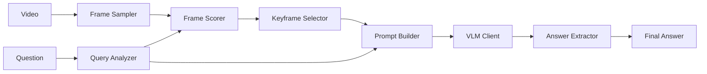

# RoadBuddy VQA - Vietnamese Traffic Law Question Answering

[](https://www.python.org/downloads/)
[](https://opensource.org/licenses/MIT)
[](https://challenge.zalo.ai/)


RoadBuddy is a modular VQA pipeline that answers multiple-choice questions about Vietnamese traffic law by analyzing dashcam video footage. The system combines query-aware keyframe selection with Vision-Language Model reasoning to achieve accurate answers within latency constraints.

## **Overview**

RoadBuddy addresses the **Zalo AI Challenge 2025 - Road Buddy** task: answering Vietnamese traffic law questions based on dashcam videos. Given a 5-15 second traffic video and a Vietnamese question with multiple choices, the system must select the correct answer within a 30-second inference budget.

### **The challenge**

- **Input**: Dashcam video (5-15s) + Vietnamese MCQ question with 2-4 choices
- **Output**: Correct answer letter (A, B, C, or D)
- **Constraint**: 30-second inference on RTX 3090/A30 GPU

### **Approach**

Implement a **three-stage pipeline**:

1. **Perception**: Query-aware keyframe selection using CLIP + YOLO
2. **Reasoning**: Vision-Language Model (Gemini/Qwen) for answer generation
3. **Extraction**: Robust answer parsing from VLM output

## **Key features**

| Feature | Description |
|---------|-------------|
| **Query-Aware Selection** | CLIP-based semantic matching between question and frames |
| **Dual VLM Support** | Google Gemini API + Local Qwen2.5-VL-7B |
| **Vietnamese NLP** | Native Vietnamese question parsing and translation |
| **YOLO Detection** | Optional object detection for enhanced scoring |
| **Multiple Strategies** | Configurable scoring, selection, and prompt styles |
| **LoRA Fine-tuning** | Efficient VLM adaptation with minimal resources |

## **Architecture**

```
.
┌────────────────────────────────────────────────────────────────────────────────┐
│                          RoadBuddy VQA Pipeline                                │
├────────────────────────────────────────────────────────────────────────────────┤
│                                                                                │
│   ┌──────────┐      ┌───────────────────┐      ┌──────────────────────────┐    │
│   │  Video   │------│  Frame Sampling   │------│    Query-Aware Scoring   │    │
│   │  Input   │      │  (Decord/OpenCV)  │      │  (CLIP + YOLO + IFD)     │    │
│   └──────────┘      └───────────────────┘      └───────────┬──────────────┘    │
│                                                            │                   │
│   ┌──────────────┐      ┌───────────────────┐     ┌──────────────────────────┐ │
│   │ Question     │------│  Query Analyzer   │-----│   Keyframe Selection     │ │
│   │ (Vietnamese) │      │ (Keyword/Trans)   │     │   (Top-K / Diverse)      │ │
│   └──────────────┘      └───────────────────┘     └──────────────────────────┘ │
│                                                            │                   │
│                                                            |                   │
│   ┌──────────────────────────────────────────────────────────────────────┐     │
│   │                        VLM Reasoning Engine                          │     │
│   │  ┌─────────────────┐              ┌─────────────────────────────┐    │     │
│   │  │  Prompt Builder │--------------│  Gemini API / Qwen2.5-VL    │    │     │
│   │  │  (Simple/CoT)   │              │  (Multimodal Inference)     │    │     │
│   │  └─────────────────┘              └──────────────┬──────────────┘    │     │
│   └──────────────────────────────────────────────────│───────────────────┘     │
│                                                      |                         │
│   ┌──────────────────────────────────────────────────────────────────────┐     │
│   │                       Answer Extraction                              │     │
│   │  Letter Extraction -> Text Matching -> Binary Heuristics -> Fallback │     │
│   └──────────────────────────────────────────────────────────────────────┘     │
│                                                      |                         │
│                                                      |                         │
│                                              ┌──────────────┐                  │
│                                              │   Answer     │                  │
│                                              │   (A/B/C/D)  │                  │
│                                              └──────────────┘                  │
└────────────────────────────────────────────────────────────────────────────────┘
```


### Component flow



## **Project structure**

```
Road-Buddy-Challenge/
├── main.py                     # Main pipeline orchestration script
├── config/
│   └── settings.py             # Centralized configuration system
├── src/
│   ├── perception/             # Visual perception module
│   │   ├── keyframe_selector.py    # Main keyframe selection orchestrator
│   │   ├── frame_scorer.py         # CLIP/MCLIP/Detection scoring
│   │   ├── query_analyzer/         # Vietnamese question parsing
│   │   │   ├── analyzer.py         # Main analyzer interface
│   │   │   ├── strategies/         # Keyword/Translation/Semantic
│   │   │   └── constants.py        # Vietnamese traffic keywords
│   │   ├── detector.py             # YOLO perception engine
│   │   └── results.py              # Detection result structures
│   ├── reasoning/              # VLM reasoning module
│   │   ├── vlm_client.py           # Gemini + Qwen2.5-VL clients
│   │   ├── prompt_builder.py       # MCQ prompt templates
│   │   └── answer_extractor.py     # Answer parsing utilities
│   ├── evaluation/             # Evaluation utilities
│   │   ├── dataset_loader.py       # VQA dataset loader
│   │   ├── metrics.py              # Accuracy, F1, confusion matrix
│   │   └── keyframe_eval.py        # Keyframe selection evaluation
│   ├── training/               # Model fine-tuning
│   │   ├── lora_trainer.py         # LoRA fine-tuning for VLM
│   │   ├── prompt_tuning.py        # Prompt optimization experiments
│   │   └── dataset_builder.py      # Training data preparation
│   └── utils/                  # Utility functions
│       ├── device.py               # GPU/CPU device management
│       └── path_setup.py           # Path resolution utilities
├── scripts/
│   └── merge_datasets.py       # Dataset merging for YOLO training
├── data/
│   ├── raw/                    # Original dataset (train/test)
│   └── custom train data/      # Custom training data
├── models/                     # Model weights (YOLO, LoRA)
├── docs/                       # Additional documentation
└── explores/                   # Jupyter notebooks for exploration
```

## **Installation**

### Prerequisites

- Python 3.10+
- NVIDIA GPU with CUDA 12.1+ (recommended: RTX 3090/A30 with 24GB+ VRAM)
- Git

### Setup

```bash
# Clone repository
git clone https://github.com/0Nguyen0Cong0Tuan0/Road-Buddy-Challenge.git
cd Road-Buddy-Challenge

# Create virtual environment
python -m venv venv
source venv/bin/activate  # Linux/Mac
# or: venv\Scripts\activate  # Windows

# Install dependencies
pip install -r requirements.txt
```

### **Environment variables**

Create a `.env` file in the project root:

```bash
# Required for Gemini API
GOOGLE_API_KEY=your_google_api_key_here
```

## **Quick Start**

**Basic Inference**

```python
from main import RoadBuddyPipeline

# Initialize pipeline with Qwen (local, no API needed)
pipeline = RoadBuddyPipeline(
    num_keyframes=8,
    vlm_model="qwen2.5-vl-7b",  # or "gemini-2.0-flash" for API
    verbose=True
)

# Process a single video
result = pipeline.process_single(
    video_path="data/raw/train/videos/video_001.mp4",
    question="Xe ô tô trong video đang vi phạm lỗi gì?",
    choices=["A. Vượt đèn đỏ", "B. Đi sai làn", "C. Dừng đỗ sai quy định", "D. Không vi phạm"]
)

print(f"Answer: {result.predicted_answer}")
print(f"Confidence: {result.confidence:.2f}")
```

**Command Line Usage**

```bash
# Single video inference
python main.py --video "path/to/video.mp4" \
    --question "Câu hỏi của bạn?" \
    --choices "A. Đáp án A" "B. Đáp án B" "C. Đáp án C" "D. Đáp án D" \
    --model qwen2.5-vl-7b \
    --verbose

# Evaluate on training set
python main.py --evaluate --train_json "data/raw/train/train.json" \
    --max_samples 100 --save_results "outputs/eval_results.json"

# Generate submission for test set
python main.py --submit --test_json "data/raw/test/test.json" \
    --output "submission.json"
```
**Evaluation Mode**
```bash
python main.py --evaluate \
    --train_json data/raw/public_test/public_test.json \
    --max_samples 50 \
    --save_results outputs/results.json \
    --keyframes 8 \
    --model qwen2.5-vl-7b \
    --prompt_style simple

>>> Evaluation results
>>> ..................................................
>>> Total Samples: 50
>>> Correct: 38
>>> Accuracy: 76.00%
>>> Avg Processing Time: 2345.6 ms
>>> Avg Confidence: 0.87
```

**Submission Mode**
```bash
python main.py --submit \
    --test_json data/raw/test/test.json \
    --output submission.json \
    --keyframes 8 \
    --model gemini-2.0-flash
```

<div align="center">

**Built for Zalo AI Challenge 2025 - Road Buddy**

</div>
